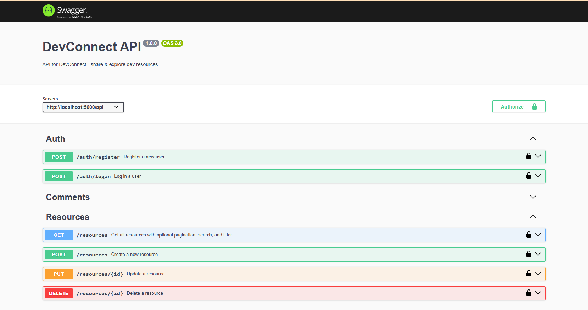

# DevConnect API

DevConnect API is a backend-only project built with **Node.js**, **Express**, and **MongoDB**, designed to help developers share and explore resources such as articles, tools, tutorials, and videos. This project was developed as part of the Keploy API Fellowship to demonstrate modern backend practices including API documentation, authentication, role-based access, Dockerization, and more.

---

## 🔗 Live Deployment
👉 [Swagger API Docs (Deployed)](https://devconnect-api-1.onrender.com/api-docs/)

---

## 🚀 Features

- ✅ User registration and login with **JWT-based Authentication**
- ✅ Role-based access control (admin/user)
- ✅ CRUD operations for dev resources (title, link, category, description)
- ✅ Add/Delete comments on resources
- ✅ MongoDB integration for persistent storage
- ✅ Swagger UI documentation for all API endpoints
- ✅ Security best practices with **Helmet**, **Rate Limiting**
- ✅ Logging via **Morgan**
- ✅ Docker support

---

## 📂 Folder Structure

```bash
├── config/           # DB configuration
├── controllers/      # Business logic
├── middleware/       # Auth, rate limit, etc.
├── models/           # Mongoose models
├── routes/           # Express routes
├── swagger.js        # Swagger UI setup
├── .env              # Environment variables
├── Dockerfile        # Docker setup
└── server.js         # Entry point
```

---

## ⚙️ Technologies Used
- **Node.js**
- **Express.js**
- **MongoDB + Mongoose**
- **JWT Authentication**
- **Swagger UI (API Docs)**
- **Docker**
- **Helmet, Morgan, Rate Limiter**

---

## 🔐 Environment Variables (`.env`)

```env
PORT=5000
MONGO_URI=your_mongodb_uri
JWT_SECRET=your_secret_key
```

---

## 🔧 API Endpoints

All documented at `/api-docs` using Swagger.
Example endpoints:

- `POST /api/auth/register`
- `POST /api/auth/login`
- `GET /api/resources`
- `POST /api/resources`
- `POST /api/comments/:resourceId`

---

## 📦 Run Locally

```bash
# Install dependencies
npm install

# Start the server
npm run dev

# View at
http://localhost:5000/api-docs
```

---

## 🐳 Run via Docker
```bash
docker build -t devconnect-api .
docker run -p 5000:5000 devconnect-api
```

---

## 📸 Screenshot


---

## ✨ Author
**Ankita Gouda**  
[GitHub](https://github.com/Ankita-624)

---

## 📣 Acknowledgments
Thanks to the **Keploy API Fellowship** team for the guidance, especially **Achanandhi M** and **Amaan Bhati** for their support in making API development beginner-friendly and impactful.

---


