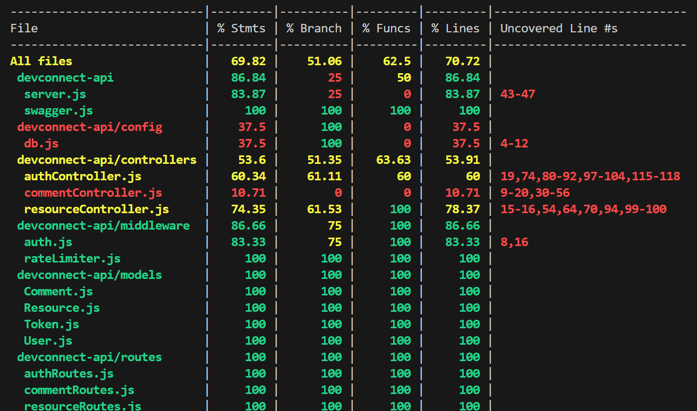
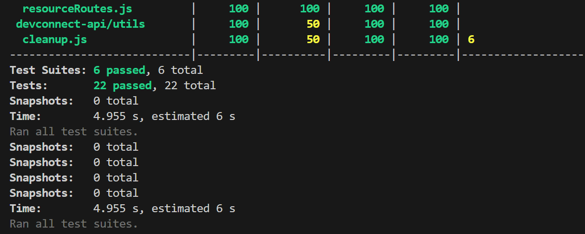

# 🚀 DevConnect API — Keploy API Fellowship Assignment 3

**DevConnect API** is a production-grade backend application built using **Node.js**, **Express**, and **MongoDB**. It enables developers to share and explore curated resources like articles, tools, and tutorials through a secure and scalable RESTful API.

This project was developed as part of **Keploy API Fellowship Assignment 3**, showcasing complete backend test coverage — including **unit, integration, and API tests** — with a focus on real-world reliability and code quality.

---

## 🔗 Live Deployment

[Swagger API Docs (Deployed)](https://devconnect-api-1.onrender.com/api-docs/)

---

## ✅ Features

- 🔐 User Registration & Login with **JWT Authentication**
- 👥 Role-based access control (**admin/user**)
- 📚 CRUD operations for developer resources
- 💬 Add/Delete comments on resources
- 💾 MongoDB integration using **Mongoose**
- 📖 Full API docs using **Swagger UI** at `/api-docs`
- 🛡️ Security: **Helmet**, **Rate Limiter**
- 🧪 Comprehensive testing with **Jest** and **Supertest**
- 🐳 Docker support for containerized deployment

---

## 🧪 Testing Highlights

This project includes all mandatory testing layers:

| Type           | Tools Used         | Description                                                 |
|----------------|--------------------|-------------------------------------------------------------|
| ✅ Unit Tests   | Jest + Mocks        | Validates controller logic (e.g., `authController`, etc.)   |
| ✅ Integration  | Jest + Supertest    | Verifies end-to-end behavior with real DB                   |
| ✅ API Tests     | Supertest           | Tests routes like register, login, CRUD, etc.               |

---

## ✅ Final Test Coverage

| Type         | Status     |
|--------------|------------|
| Unit Tests   | ✅ Achieved 70%+ |
| Integration  | ✅ Implemented |
| API Tests    | ✅ Complete  |

---

## 📸 Test Coverage Summary: 



---
## 🏗️ Folder Structure
 ```
├── config/              # DB Configuration
├── controllers/         # Logic for auth, resource, comments
├── middleware/          # JWT Auth, rate limiter
├── models/              # Mongoose schemas
├── routes/              # API route definitions
├── tests/               # Unit/Integration/API tests
├── utils/               # Cleanup utility
├── swagger.js           # Swagger UI configuration
├── server.js            # Entry point of the app
├── Dockerfile           # Docker setup
└── .env.example         # Sample environment variables
```
---

## ⚙️  Technologies Used :
- Node.js, Express.js

- MongoDB + Mongoose

- JWT for secure authentication

- Swagger UI for auto API docs

- Jest for unit & integration testing

- Supertest for HTTP route testing

- Docker, Helmet, Morgan, Rate Limiter

---

## 🔐  Environment Variables:
```
PORT=5000
MONGO_URI=your_mongodb_connection_string
JWT_SECRET=your_jwt_secret
REFRESH_TOKEN_SECRET=your_refresh_token_secret
Save this as .env in your root directory
```
---

## 🔧  Run Locally

 **Install dependencies**
npm install

**Start dev server**
npm run dev

**Visit Swagger docs**
http://localhost:5000/api-docs

---

## 🐳 Run via Docker:

 **Build the image**
docker build -t devconnect-api .

**Run the container**
docker run -p 5000:5000 devconnect-api

---
---

## ✨ Author
*Ankita Gouda*  
[GitHub](https://github.com/Ankita-624)

---

---

## 🙌 Acknowledgments
```
Huge thanks to the Keploy API Fellowship team for creating an opportunity to dive into modern testing.
Gratitude to Achanandhi M, Amaan Bhati, and the amazing open-source mentors.
```
---

## 🧠 What I Learned:
```
🧪 Writing unit tests using Jest with mocks and real DB

🔄 Building complete integration + API tests with Supertest

📊 Interpreting and improving test coverage reports

🛠️ Debugging complex controller test cases

✅ Reaching 70%+ code coverage while maintaining real-world structure
```
---
## 📣 Social Post 
```
Just wrapped up Assignment 3 for the #Keploy API Fellowship!
✅ Unit, Integration, and API tests ✔
✅ 70%+ backend test coverage 📊
✅ Mocking, debugging, Swagger docs — learned so much!
Huge thanks to @KeployIO and the open-source mentors!
```
